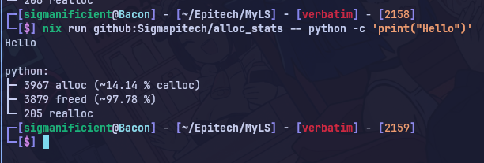

# Alloc stat



## Usage

set the `AS_VERBOSE` environment variable to `1` to print every allocation call.

### using Nix

> Run directly
```sh
nix run github:Sigmapitech/alloc_stats -- ls
```

### without Nix

> Clone the repository
```sh
git clone Sigmapitech/alloc_stats
cd alloc_stats
```

> Build the library
```sh
make
```

> Run by using preloading
```sh
LD_PRELOAD=liballoc_stats.so ls
```
